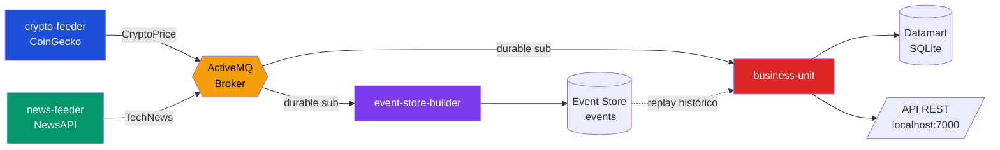
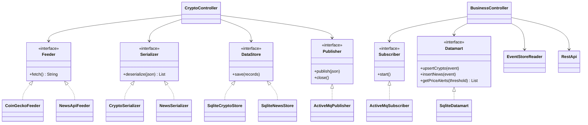

# CryptoBros Analytics

## Descripción y Propuesta de Valor

CryptoBros Analytics es un sistema de arquitectura **Lambda** en Java 21 que captura precios de criptomonedas (CoinGecko) y noticias tecnológicas (NewsAPI) en tiempo real, los almacena de forma duradera y genera **valor añadido real** para el usuario.

La propuesta de valor no es mostrar ambas fuentes por separado, sino **detectar automáticamente movimientos bruscos en el precio de las criptomonedas y correlacionarlos con las noticias publicadas en ese mismo momento**, generando alertas interpretables.

Es decir, el sistema responde a una pregunta concreta que ninguna de las dos fuentes responde por sí sola: *"¿Bitcoin acaba de caer un 20%, qué estaba pasando en las noticias justo en ese momento?"*

Aplicando la fórmula **datos + tratamiento + propósito**:
- **Datos**: precios de criptomonedas + noticias tecnológicas.
- **Tratamiento**: cálculo de la variación porcentual entre capturas, detección de movimientos que superan un umbral configurable, y asociación temporal con las noticias más cercanas.
- **Propósito**: alertar al usuario de posibles relaciones entre eventos noticiosos y movimientos de mercado para ayudarle a interpretar qué ocurre.

## Justificación de las APIs

- **CoinGecko API**: gratuita, sin autenticación, con datos en constante cambio de precio, capitalización y volumen. Ideal para capturar información dinámica.
- **NewsAPI**: titulares de fuentes globales filtrados por categoría tecnológica, en formato JSON estructurado fácil de procesar.

La combinación de ambas permite analizar si las noticias tecnológicas y financieras tienen relación con los movimientos del mercado cripto.

## Arquitectura del Sistema



Los dos feeders capturan datos cada 30 minutos y publican eventos en ActiveMQ con los campos obligatorios `ts` (timestamp UTC) y `ss` (fuente). Dos suscriptores con suscripción durable consumen en paralelo: el `event-store-builder` persiste todo en disco (batch layer) y el `business-unit` mantiene el datamart y expone la API REST.

## Diagrama de Clases



Todos los módulos programan contra interfaces. El `Controller` solo conoce las interfaces, nunca las implementaciones concretas, lo que permite cambiar una implementación sin tocar el resto del código.

## Estructura del Datamart

El datamart en SQLite tiene tres tablas:

- **crypto_latest**: precio actual de cada cripto. Usa UPSERT (INSERT ON CONFLICT UPDATE) para mantener siempre el último valor sin duplicados. Clave primaria: `coin_id`.
- **crypto_history**: histórico ilimitado de precios con timestamp, base para detectar los movimientos bruscos.
- **news**: noticias con título, fuente, URL y timestamps.

Esta estructura separa el dato actual (consulta rápida) del histórico (análisis temporal y detección de alertas).

## Tecnologías

- Java 21 · Maven multimódulo
- ActiveMQ Classic 5.19.6 (broker) · activemq-client 5.15.12
- SQLite JDBC 3.45.3.0
- OkHttp 4.12.0 · Gson 2.10.1 · Jackson 2.15.0
- Javalin 5.6.3 (API REST) · slf4j-simple 1.7.36

## Requisitos Previos

1. Java 21 o superior
2. Maven
3. ActiveMQ Classic 5.x descargado y descomprimido

## Configuración

Cada módulo se configura mediante su propio archivo `config.properties` ubicado en `src/main/resources/`. No hay ningún valor hardcodeado en el código.

**crypto-feeder** (`crypto-feeder/src/main/resources/config.properties`):
```properties
coingecko.url=https://api.coingecko.com/api/v3/coins/markets?vs_currency=usd&order=market_cap_desc&per_page=10&page=1
database.path=crypto.db
broker.url=tcp://localhost:61616
broker.topic=CryptoPrice
capture.interval.minutes=30
```

**news-feeder** (`news-feeder/src/main/resources/config.properties`):
```properties
newsapi.key=TU_API_KEY_AQUI
newsapi.url=https://newsapi.org/v2/top-headlines?category=technology&language=en&pageSize=10&apiKey=
database.path=news.db
broker.url=tcp://localhost:61616
broker.topic=TechNews
capture.interval.minutes=30
```

**event-store-builder** (`event-store-builder/src/main/resources/config.properties`):
```properties
broker.url=tcp://localhost:61616
broker.topics=CryptoPrice,TechNews
broker.client.id=event-store-builder
eventstore.path=eventstore
```

**business-unit** (`business-unit/src/main/resources/config.properties`):
```properties
broker.url=tcp://localhost:61616
broker.topics=CryptoPrice,TechNews
broker.client.id=business-unit
datamart.path=datamart.db
eventstore.path=eventstore
api.port=7000
alert.threshold.percent=3.0
```

El parámetro `alert.threshold.percent` controla la sensibilidad de las alertas: un valor de 3.0 dispara una alerta cuando una cripto varía un 3% o más entre dos capturas.

## Cómo Compilar y Ejecutar

### 1. Clonar y compilar

```bash
git clone https://github.com/abdela758/cryptonews-analytics.git
cd cryptonews-analytics
mvn clean install -DskipTests
```

### 2. Arrancar ActiveMQ

```bash
# Windows
ruta\a\apache-activemq-5.19.6\bin\activemq.bat start

# Mac/Linux
./apache-activemq-5.19.6/bin/activemq start
```

Verificar en `http://localhost:8161` (usuario `admin`, contraseña `admin`).

### 3. Ejecutar los módulos (en este orden)

| Orden | Módulo | Clase Main |
|---|---|---|
| 1 | event-store-builder | `org.ulpgc.dacd.eventstore.Main` |
| 2 | business-unit | `org.ulpgc.dacd.business.Main` |
| 3 | crypto-feeder | `org.ulpgc.dacd.crypto.Main` |
| 4 | news-feeder | `org.ulpgc.dacd.news.Main` |

Primero los suscriptores (para que estén escuchando) y luego los feeders (que publican).

## Ejemplos de Uso — API REST

La API corre en `http://localhost:7000`:

| Endpoint | Descripción |
|---|---|
| `GET /api/cryptos` | Precios actuales de las 10 principales criptomonedas |
| `GET /api/cryptos/{id}/history` | Historial de precios de una cripto (ej: `bitcoin`) |
| `GET /api/news` | Últimas 20 noticias tecnológicas |
| `GET /api/alerts` | **Alertas de movimientos bruscos con noticias asociadas (propuesta de valor)** |
| `GET /api/analysis/{coinId}` | Noticias cruzadas con precio por timestamp |

### Ejemplo — `GET /api/alerts`

```json
[
  {
    "coin_id": "bitcoin",
    "previous_price": 77093,
    "current_price": 61932,
    "change_percent": -19.67,
    "direction": "DOWN",
    "detected_at": "2026-06-10T18:32:25Z",
    "related_news": [
      {
        "title": "Apple Says iOS 27 Adds These 12 New Features...",
        "source": "MacRumors",
        "published_at": "2026-06-09T16:47:47Z"
      }
    ]
  }
]
```

Cada alerta indica la cripto, el precio anterior y actual, la variación porcentual, la dirección (UP/DOWN), cuándo se detectó y las 3 noticias más cercanas en el tiempo.

## Estructura del Event Store

```
eventstore/
├── CryptoPrice/
│   └── crypto-feeder/
│       └── 20260610.events
└── TechNews/
    └── news-feeder/
        └── 20260610.events
```

Cada archivo `.events` contiene un evento JSON por línea (formato JSON Lines/NDJSON), añadidos al final sin sobrescribir.

## Principios y Patrones de Diseño

- **Programación orientada a interfaces** en todos los módulos (Feeder, Serializer, DataStore, Publisher, Subscriber, Datamart).
- **Single Responsibility**: cada clase tiene una única función.
- **Publisher/Subscriber** con desacoplamiento total entre productores y consumidores.
- **Suscripción durable**: ningún evento se pierde si un consumidor se desconecta.
- **Modelo de dominio separado del JSON externo** (CryptoRecord, NewsRecord).
- **Persistencia incremental**: nunca se borran datos.
- **Controller como coordinador**: sin lógica de negocio, solo orquesta.
- **Configuración externalizada**: cero valores hardcodeados, todo en `config.properties`.

## Equipo

- **Abdelaziz**: crypto-feeder, event-store-builder
- **Rayan**: news-feeder, business-unit

Repositorio: [github.com/abdela758/cryptonews-analytics](https://github.com/abdela758/cryptonews-analytics)
